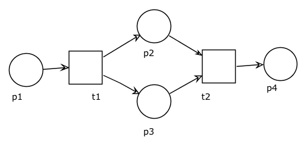
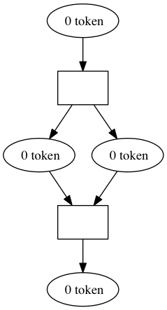

# Documentation

This library follows the definition of the basic Petrinet model with weighted arcs as described
[here](http://en.wikipedia.org/wiki/Petri_net), roughly:

- there are two types of nodes: Places and Transitions
- these nodes are connected with Arcs having a weight
- a Petrinet is a set of Places and Transitions
- a Place Marking associates a set of Tokens to a place
- a Marking is a set of Place Markings
- a Petrinet can be executed against a Marking

In workflow words, the Petrinet is the workflow structure and each marking is a workflow instance.

## Model

This library provides the models of basic Petrinets that you can use directly to work without persistence
or extend with your custom entities mapped to a database with any ORM.

## Builder

All builders make usage of a `FactoryInterface` that is reponsible for creating model instances.
By default, the factory is configured to create models present in this library, but it is possible to configure it
to create your custom model instances (for example Doctrine Entities) by passing the class names to its constructor.

```php
// Instanciating the factory
$factory = new \Petrinet\Model\Factory();
```

### Petrinet Builder

The Petrinet builder helps creating places and transitions, connecting them with arcs
and retrieving the resulting Petrinet.

#### Overview

```php
// Instanciating the builder
$builder = new \Petrinet\Builder\PetrinetBuilder($factory);

// Creating a place
$place = $builder->place();

// Creating a transition
$transition = $builder->transition();

// Connecting a place to a transition
$builder->connect($place, $transition);

// Connecting a transition to a place
$builder->connect($transition, $place);

// Connecting a place to a transition with an arc of weight 3
$builder->connect($place, $transition, 3);

// Retrieving the Petrinet
$petrinet = $builder->getPetrinet();
```

#### Example

This example shows how to create the following Petrinet: .

```php
$petrinet = $builder
    ->connect($builder->place(), $t1 = $builder->transition())
    ->connect($t1, $p2 = $builder->place())
    ->connect($t1, $p3 = $builder->place())
    ->connect($p2, $t2 = $builder->transition())
    ->connect($p3, $t2)
    ->connect($t2, $builder->place())
    ->getPetrinet();
```

### Marking Builder

The marking builder helps creating place markings and retrieving the resulting Petrinet marking
(the places can be created manually or using the `PetrinetBuilder` above).

#### Overview

```php
// Instanciating the builder
$builder = new \Petrinet\Builder\MarkingBuilder($factory);

// Marks a place with the specified tokens number
$builder->mark($place, 3);

// Marks a place with the specified token
$builder->mark($place, new \Petrinet\Model\Token());

// Marks a place with the specified tokens
$builder->mark($place, array(new \Petrinet\Model\Token(), new \Petrinet\Model\Token()));

// Retrieving the Marking
$marking = $builder->getMarking();
```

#### Example

This example shows how to create a marking containing two place markings:

- The place `$p1` is marked with 3 tokens
- The place `$p2` is marked with 2 tokens

```php
$marking = $markingBuilder
    ->mark($p1, 3)
    ->mark($p2, 2)
    ->getMarking();
```

## Service

The transition service allows you to check if a transition is enabled in a given marking and fire an enabled
transition.

```php
// Instanciates the transition service
$transitionService = new \Petrinet\Service\TransitionService($factory);

// Checks if the transition is enabled in the given marking
$transitionService->isEnabled($transition, $marking);

// Fires the transition in the given marking
try {
    $transitionService->fire($transition, $marking);
} catch (\Petrinet\Service\Exception\TransitionNotEnabledException $e) {
    // The transition is not enabled and cannot be fired
}
```

Firing a transition will modify the place markings by removing and adding new tokens to them.
It will also create missing place markings if not existing.
The persistence of the marking after firing a transition is up to you.

## Dumper

### Graphviz Dumper

The Graphviz dumper dumps a Petrinet as a string in `dot` format that can be processed by
the [Graphviz](http://www.graphviz.org) software.

#### Usage

```php
// Instanciates the Dumper
$dumper = new \Petrinet\Dumper\GraphvizDumper();

// Dumps the Petrinet structure
$string = $dumper->dump($petrinet);

// Dumps the Petrinet in a given marking
$string = $dumper->dump($petrinet, $marking);
```

You can write the resulting string in a file:

```php
file_put_contents('petrinet.dot', $string);
```

and transform it to a PNG image using the command:

```bash
$ dot -Tpng petrinet.dot > petrinet.png
```

You will obtain this kind of image:

.

## Database Mapping

### Doctrine ORM

The following example shows the basic mapping for the Petrinet model classes using Doctrine2 ORM.

#### Petrinet

```php
<?php

namespace Acme\Bundle\WorkflowBundle\Entity;

use Doctrine\ORM\Mapping as ORM;
use Petrinet\Model\Petrinet as BasePetrinet;

/**
 * @ORM\Entity
 * @ORM\Table(name="petrinet")
 */
class Petrinet extends BasePetrinet
{
    /**
     * @ORM\Id
     * @ORM\GeneratedValue
     * @ORM\Column(type="integer")
     */
    protected $id;

    /**
     * @ORM\ManyToMany(targetEntity="Acme\Bundle\WorkflowBundle\Entity\Place", cascade={"persist"})
     * @ORM\JoinTable(
     *  name="petrinet_place_xref",
     *  joinColumns={@ORM\JoinColumn(name="petrinet_id")},
     *  inverseJoinColumns={@ORM\JoinColumn(name="place_id", unique=true)}
     * )
     */
    protected $places;

    /**
     * @ORM\ManyToMany(targetEntity="Acme\Bundle\WorkflowBundle\Entity\Transition", cascade={"persist"})
     * @ORM\JoinTable(
     *  name="petrinet_transition_xref",
     *  joinColumns={@ORM\JoinColumn(name="petrinet_id")},
     *  inverseJoinColumns={@ORM\JoinColumn(name="transition_id", unique=true)}
     * )
     */
    protected $transitions;
}
```

#### InputArc

```php
<?php

namespace Acme\Bundle\WorkflowBundle\Entity;

use Doctrine\ORM\Mapping as ORM;
use Petrinet\Model\InputArc as BaseInputArc;

/**
 * @ORM\Entity
 * @ORM\Table(name="input_arc")
 */
class InputArc extends BaseInputArc
{
    /**
     * @ORM\Id
     * @ORM\GeneratedValue
     * @ORM\Column(type="integer")
     */
    protected $id;

    /**
     * @ORM\ManyToOne(targetEntity="Acme\Bundle\WorkflowBundle\Entity\Place", inversedBy="outputArcs")
     */
    protected $place;

    /**
     * @ORM\ManyToOne(targetEntity="Acme\Bundle\WorkflowBundle\Entity\Transition", inversedBy="inputArcs")
     */
    protected $transition;

    /**
     * @ORM\Column(type="integer", nullable=false)
     */
    protected $weight;
}
```

#### OutputArc

```php
<?php

namespace Acme\Bundle\WorkflowBundle\Entity;

use Doctrine\ORM\Mapping as ORM;
use Petrinet\Model\OutputArc as BaseOutputArc;

/**
 * @ORM\Entity
 * @ORM\Table(name="output_arc")
 */
class OutputArc extends BaseOutputArc
{
    /**
     * @ORM\Id
     * @ORM\GeneratedValue
     * @ORM\Column(type="integer")
     */
    protected $id;

    /**
     * @ORM\ManyToOne(targetEntity="Acme\Bundle\WorkflowBundle\Entity\Place", inversedBy="inputArcs")
     */
    protected $place;

    /**
     * @ORM\ManyToOne(targetEntity="Acme\Bundle\WorkflowBundle\Entity\Transition", inversedBy="outputArcs")
     */
    protected $transition;

    /**
     * @ORM\Column(type="integer", nullable=false)
     */
    protected $weight;
}
```

#### Marking

```php
<?php

namespace Acme\Bundle\WorkflowBundle\Entity;

use Doctrine\ORM\Mapping as ORM;
use Petrinet\Model\Marking as BaseMarking;

/**
 * @ORM\Entity
 * @ORM\Table(name="marking")
 */
class Marking extends BaseMarking
{
    /**
     * @ORM\Id
     * @ORM\GeneratedValue
     * @ORM\Column(type="integer")
     */
    protected $id;

    /**
     * @ORM\ManyToMany(targetEntity="Acme\Bundle\WorkflowBundle\Entity\PlaceMarking", cascade={"persist"})
     * @ORM\JoinTable(
     *  name="marking_place_marking_xref",
     *  joinColumns={@ORM\JoinColumn(name="marking_id")},
     *  inverseJoinColumns={@ORM\JoinColumn(name="place_marking_id", unique=true)}
     * )
     */
    protected $placeMarkings;
}
```

#### Place

```php
<?php

namespace Acme\Bundle\WorkflowBundle\Entity;

use Doctrine\ORM\Mapping as ORM;
use Petrinet\Model\Place as BasePlace;

/**
 * @ORM\Entity
 * @ORM\Table(name="place")
 */
class Place extends BasePlace
{
    /**
     * @ORM\Id
     * @ORM\GeneratedValue
     * @ORM\Column(type="integer")
     */
    protected $id;

    /**
     * @ORM\OneToMany(
     *   targetEntity="Acme\Bundle\WorkflowBundle\Entity\OutputArc",
     *   mappedBy="place",
     *   cascade={"persist"}
     * )
     */
    protected $inputArcs;

    /**
     * @ORM\OneToMany(
     *   targetEntity="Acme\Bundle\WorkflowBundle\Entity\InputArc",
     *   mappedBy="place",
     *   cascade={"persist"}
     * )
     */
    protected $outputArcs;
}
```

#### Place Marking

```php
<?php

namespace Acme\Bundle\WorkflowBundle\Entity;

use Doctrine\ORM\Mapping as ORM;
use Petrinet\Model\PlaceMarking as BasePlaceMarking;

/**
 * @ORM\Entity
 * @ORM\Table(name="place_marking")
 */
class PlaceMarking extends BasePlaceMarking
{
    /**
     * @ORM\Id
     * @ORM\GeneratedValue
     * @ORM\Column(type="integer")
     */
    protected $id;

    /**
     * @ORM\ManyToOne(targetEntity="Acme\Bundle\WorkflowBundle\Entity\Place")
     */
    protected $place;

    /**
     * @ORM\ManyToMany(targetEntity="Acme\Bundle\WorkflowBundle\Entity\Token", cascade={"persist"})
     * @ORM\JoinTable(
     *  name="place_marking_token_xref",
     *  joinColumns={@ORM\JoinColumn(name="place_marking_id")},
     *  inverseJoinColumns={@ORM\JoinColumn(name="token_id", unique=true)}
     * )
     */
    protected $tokens;
}
```

#### Token

```php
<?php

namespace Acme\Bundle\WorkflowBundle\Entity;

use Doctrine\ORM\Mapping as ORM;
use Petrinet\Model\Token as BaseToken;

/**
 * @ORM\Entity
 * @ORM\Table(name="token")
 */
class Token extends BaseToken
{
    /**
     * @ORM\Id
     * @ORM\GeneratedValue
     * @ORM\Column(type="integer")
     */
    protected $id;
}
```

#### Transition

```php
<?php

namespace Acme\Bundle\WorkflowBundle\Entity;

use Doctrine\ORM\Mapping as ORM;
use Petrinet\Model\Transition as BaseTransition;

/**
 * @ORM\Entity
 * @ORM\Table(name="transition")
 */
class Transition extends BaseTransition
{
    /**
     * @ORM\Id
     * @ORM\GeneratedValue
     * @ORM\Column(type="integer")
     */
    protected $id;

    /**
     * @ORM\OneToMany(
     *   targetEntity="Acme\Bundle\WorkflowBundle\Entity\InputArc",
     *   mappedBy="transition",
     *   cascade={"persist"}
     * )
     */
    protected $inputArcs;

    /**
     * @ORM\OneToMany(
     *   targetEntity="Acme\Bundle\WorkflowBundle\Entity\OutputArc",
     *   mappedBy="transition",
     *   cascade={"persist"}
     * )
     */
    protected $outputArcs;
}
```
